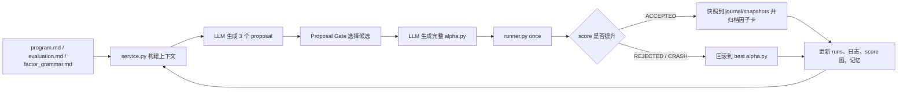

# AutoAlpha Demo

一个面向量化因子研究的自主迭代框架：它把固定数据切分、因子代码、回测评分、研究约束、LLM 提案、运行审计和 Web 控制台串成一条可持续运行的研究流水线。

> 重要声明：本项目是研究与教学框架，不构成投资建议。示例策略、评分函数和回测结果都不能直接代表未来实盘表现。

## 核心能力

- **自动因子迭代**：LLM 只允许改 `alpha.py`，每轮生成一个完整候选版本，由 `runner.py once` 评估。
- **OpenAI-compatible API**：支持 OpenAI 兼容接口，也支持 LM Studio、Ollama 网关、vLLM 等本地或私有模型服务。
- **Proposal Gate**：调用 LLM 写完整代码前，先生成 3 个候选 proposal，本地根据当前瓶颈选择一个再实现，减少盲目试错。
- **Bottleneck Detector**：自动从最近 best 的 `score_breakdown.raw/weighted` 识别瓶颈，例如年度稳定性低、换手惩罚高、复杂度惩罚高、同质化惩罚高、收益/回撤效率低。
- **连续上下文记忆**：服务会把 accepted/rejected/crashed 的研究经验写入 `service_state/memory.json`，下一轮提示词会继承这些记忆。
- **完整日志体系**：审计日志、行动日志、研究日志、交付日志分开保存，Web 页面以卡片形式实时展示。
- **可视化观察台**：Web 控制台展示运行状态、score 随迭代变化图、当前流程高亮、`journal/runs.jsonl` 卡片、四类实时日志和服务记忆。
- **回测与护栏**：固定 train/val/test 切分，test 默认锁定；runner 负责禁词扫描、信号校验、相关性门控、accept/revert、快照和因子卡归档。

## 项目结构

```text
.
├── alpha.py              # 当前候选因子实现；在线服务/LLM 唯一可改文件
├── runner.py             # 单轮实验执行器：评估、记录、快照、回滚
├── service.py            # 本地 Web 服务与持续迭代循环
├── prepare.py            # 数据加载、标签、回测和 primary_score
├── metrics.py            # 诊断指标：IC decay、分位收益、因子相关性等
├── factor_library.py     # accepted 因子卡归档与图表生成
├── program.md            # 研究议程：agent 能做什么、优先做什么、不能做什么
├── evaluation.md         # 评估宪法：score、标签、回测和切分定义
├── factor_grammar.md     # proposal gate 的候选因子语法与研究空间
├── cache/
│   └── splits.json       # 固定切分与数据 checksum
├── journal/              # 运行后生成；默认不进入 git
├── factor_library/       # accepted 因子卡；默认不进入 git
├── service_state/        # API 配置、服务记忆、在线日志；默认不进入 git
└── stock_data/           # 本地行情数据；默认不进入 git
```

## 工作流



## 环境要求

- Python 3.10+
- macOS/Linux/Windows 均可；本项目开发环境为 macOS
- 本地行情数据放在 `stock_data/`
- 可选：OpenAI-compatible LLM 服务，用于在线持续迭代

安装依赖：

```bash
python -m venv .venv
. .venv/bin/activate
pip install -r requirements.txt
```

如果你不使用虚拟环境，也可以直接安装依赖：

```bash
pip install numpy pandas scipy matplotlib pyarrow
```

## 数据准备

本仓库默认不包含行情数据。请在项目根目录创建 `stock_data/`，并放入以下文件：

```text
stock_data/
├── stock_daily_post_2016_2026_all.parquet
├── benchmark_852_all.parquet
└── trading_Calendar.parquet
```

`cache/splits.json` 记录了固定切分和数据 checksum。替换数据后，如果 checksum 不匹配，`prepare.py` 会拒绝继续，以避免研究结果不可复现。

默认切分：

| 分段 | 日期 |
|---|---|
| train | 2016-01-04 到 2021-12-03 |
| val | 2021-12-04 到 2024-12-03 |
| test | 2024-12-04 到 2026-06-04 |

## 快速开始：手动跑一轮

查看当前状态：

```bash
python runner.py status
```

运行一轮实验：

```bash
python runner.py once
```

runner 会执行：

1. 读取并静态扫描 `alpha.py`
2. 校验 `ITER_NOTE`
3. 加载 train/val 数据
4. 调用 `alpha.run(train_panel, val_panel)`
5. 校验信号格式与截面标准化
6. 计算 IC、回测和 `prepare.primary_score()`
7. 与 `journal/best.json` 对比
8. accepted 则快照；rejected/crash 则回滚到 best
9. 追加写入 `journal/runs.jsonl` 和 `journal/notes/{iter}.md`

常用命令：

```bash
python runner.py status
python runner.py once
python runner.py reset
```

## 启动在线服务

默认端口：

```bash
.venv/bin/python service.py
```

打开：

```text
http://127.0.0.1:8765
```

如果端口被占用：

```bash
AUTOALPHA_SERVICE_PORT=8766 .venv/bin/python service.py
```

Web 控制台提供：

- OpenAI-compatible API 配置与连接测试
- 启动/停止持续迭代
- 当前 runner 状态
- score 随迭代次数实时图
- 项目流程图与当前步骤高亮
- `journal/runs.jsonl` 实时卡片
- audit/action/research/delivery 四类日志卡片
- 连续上下文记忆查看与重置
- 手工追加日志备注

只有点击页面里的停止按钮，或结束 `service.py` 进程，持续迭代才会停止。

## 接入 LM Studio 本地模型

1. 在 LM Studio 中加载一个聊天模型。
2. 打开 LM Studio 的本地 server。
3. 确认服务地址类似：

```text
http://127.0.0.1:1234/v1
```

4. 在 AutoAlpha Web 页面填写：

```text
Base URL: http://127.0.0.1:1234/v1
API Key:  lm-studio
Model:    你的 LM Studio 模型名
```

页面里的“填入 LM Studio”会自动填入默认地址和示例 key。点击“测试连接”时，服务会同时验证：

- `GET /v1/models`
- `POST /v1/chat/completions`

测试成功后，再点击“启动持续迭代”。

## OpenAI-compatible API 配置

服务端配置保存在 `service_state/config.json`，该目录默认被 `.gitignore` 排除。

需要的字段：

| 字段 | 说明 |
|---|---|
| Base URL | 兼容 API 的 `/v1` 地址，例如 `https://api.example.com/v1` |
| API Key | 访问密钥；页面再次读取时会显示为 `********` |
| Model | 模型名，必须被 `/v1/models` 或 chat completions 接受 |
| Temperature | 建议从 `0.2` 到 `0.4` 开始 |
| Iteration Sleep | 每轮结束后的等待秒数 |
| Memory Enabled | 是否把历史迭代记忆注入下一轮上下文 |

## 日志与产物

运行产物默认不进入 git：

```text
journal/
├── best.json
├── runs.jsonl
├── notes/
├── snapshots/
└── last_failed/

factor_library/
├── index.json
├── index.md
└── Fxxxx_*/

service_state/
├── config.json
├── memory.json
└── logs/
    ├── audit.jsonl
    ├── action.jsonl
    ├── research.jsonl
    └── delivery.jsonl
```

四类服务日志：

| 日志 | 内容 |
|---|---|
| audit | 配置保存、连接测试、启动、停止、异常、循环状态 |
| action | 文件替换、runner 命令、git auto-commit、输出摘要 |
| research | proposal、上下文摘要、瓶颈检测、模型研究说明 |
| delivery | 每轮 score、decision、核心指标、交付结果 |

## 评分机制

当前评估版本为 `trade_v4`，唯一实现来源是 `prepare.primary_score()`。`evaluation.md` 是人类可读规约，runner 的 accept/revert 只认 `ScoreReport.score`。

简化理解：

```text
score = IC 预测能力
      + 超额 Sharpe / 超额年化
      + 绝对 Sharpe / 绝对年化
      + 收益/回撤效率
      + 年度稳定性 / 回撤质量 / 分组单调性
      - 换手惩罚
      - 复杂度惩罚
      - 同质化惩罚
```

这个设计的目标不是追求单一漂亮 IC，而是降低以下坏解被接受的概率：

- IC 高但收益质量差
- 回撤很深但 score 仍然高
- 高换手微调
- 堆叠高度相关因子
- 复杂黑盒代码换取小幅提升

## `alpha.py` 协议

`alpha.py` 必须提供：

```python
HORIZON = 20
LABEL_KIND = "rank"

ITER_NOTE = {
    "op_type": "add_factor",
    "hypothesis": "...",
    "change": "...",
    "expected": "...",
}

def run(train_panel, val_panel):
    return signal_train, signal_val
```

返回值要求：

- `signal_train` 和 `signal_val` 都是 `[date x symbol]` 的 `pandas.DataFrame`
- index 必须是 `DatetimeIndex`
- 每日截面均值接近 0
- 每日截面标准差在合理范围内
- 不允许触碰 test 段
- 不允许读取 `journal/`、`factor_library/` 等历史产物作为特征

## 研究护栏

runner 会在 import `alpha.py` 前做禁词扫描。出现以下敏感字符串会直接 crash 并回滚：

```text
_load_test_panel
AUTOALPHA_TEST_LOCKED
factor_library
_test_metrics
journal
test_eval
judge
splits.json
```

这不是语法限制，而是防止数据泄露和测试集污染。

## Proposal Gate 与瓶颈检测

在线服务每轮分两段调用 LLM：

1. 只要求模型返回 3 个候选 proposal。
2. 本地根据 bottleneck、memory、factor grammar 给 proposal 打分。
3. 选择最符合当前瓶颈的一项。
4. 再要求模型只实现被选中的 proposal，并返回完整 `alpha.py`。

proposal 必须声明：

```json
{
  "id": "P1",
  "summary": "新增低相关价量背离因子",
  "hypothesis": "...",
  "change": "...",
  "expected": "...",
  "op_type": "add_factor",
  "family": "price_volume_divergence",
  "primitive": "close, volume",
  "transform": "rolling rank zscore",
  "target_bottleneck": "year_stability_low",
  "targets": ["year_stability", "excess_efficiency"],
  "risk": "..."
}
```

`factor_grammar.md` 维护候选因子族和不鼓励方向，用来提升构造因子的丰富性。

## 连续上下文记忆

服务记忆位于：

```text
service_state/memory.json
```

它会记录：

- 当前 best 摘要
- 最近 accepted/rejected/crashed 研究
- promising ideas
- avoid list
- score version

如果 `journal/runs.jsonl` 存在，服务会自动从当前 score version 的历史记录 seed memory。这样即使升级 proposal gate 或 reward 机制，也能在新版本初次基准中继承前一阶段最有价值的经验。

## Git 与发布建议

建议发布前检查：

```bash
git status --short
git ls-files
rg -n "sk-[A-Za-z0-9]|api[_-]?key|Bearer|password|secret|token" .
```

默认 `.gitignore` 已排除：

- `.venv/`
- `stock_data/`
- `journal/`
- `factor_library/`
- `service_state/`
- 大型缓存文件

## 常见问题

### 为什么我的服务启动后没有继续迭代？

检查页面 API 配置是否完整，并点击“测试连接”。持续迭代要求 `base_url`、`api_key`、`model` 都存在。

### LM Studio 明明开着，为什么测试失败？

确认 LM Studio server 已启动，模型已加载，Base URL 末尾包含 `/v1`。有些本地模型名需要完全匹配 `/v1/models` 返回的 `id`。

### 为什么 rejected 后 `alpha.py` 变回去了？

这是正常行为。runner 发现分数没有超过 best，或代码 crash，会自动把 `alpha.py` 回滚到 `journal/best.json` 指向的快照。

### 为什么 score 高但收益指标不一定漂亮？

score 是多目标加权函数，不等于实盘收益。请同时看 annual return、excess return、Sharpe、max drawdown、turnover、year stability 和 factor correlation。

### 能直接用于实盘吗？

不建议。实盘前至少需要独立数据源复核、test 段复核、交易成本敏感性分析、滑点模型、停复牌/涨跌停处理复查、组合约束、风控和人工审批。

## License

MIT License. See [LICENSE](LICENSE).
